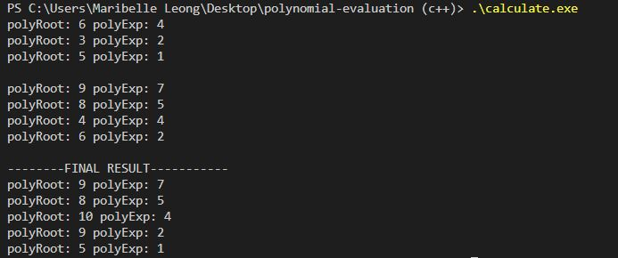

# Polynomials Evaluation

A C++ Program to calculate the coefficient and exponent of polynomials using linked list

## Terminal's Look

## Explanation

there are 2 text files containing a number each row.  
--num1.txt--  
6  
4  
3  
2  
5  
1  
represents
6x^4 + 3x^2 + 5X

--num2.txt--  
9  
7  
8  
5  
4  
4  
6  
2  
represents
9x^7 + 8x^5 + 4x^4 + 6x^2

adding their coefficients and exponentials together becomes
9x^7 + 8x^5 + 10x^4 + 9x^2 + 5x^1

--result.txt--  
9  
7  
8  
5  
10  
4  
9  
2  
5  
1  
